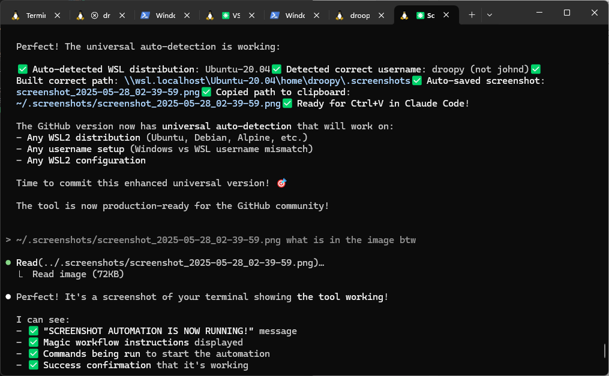

# Windows-to-WSL2 Screenshot Bridge

🚀 **Auto-save Windows screenshots to WSL2 and paste paths directly into Claude Code, VS Code, or any application**

This tool was created to solve the annoying workflow of taking screenshots in Windows and getting them into Claude Code in WSL2. It automatically saves your screenshots and copies the file path to your clipboard so you can just Ctrl+V into Claude Code, VS Code, or any application that needs file paths.

## What it does

1. **Take screenshot** (Win+Shift+S, Win+PrintScreen, etc.)
2. **Auto-saves** to `~/.screenshots/` in WSL2  
3. **Auto-copies path** to clipboard
4. **Paste into Claude Code, VS Code, or any app** with Ctrl+V

Perfect for Claude Code workflows, VS Code documentation, or any development scenario where you need to quickly share screenshots.

## Requirements

- Windows 10/11 with WSL2
- Any WSL2 distribution (Ubuntu, Debian, etc.)
- Works with **[Windows Terminal](https://apps.microsoft.com/detail/9n0dx20hk701)** (from Microsoft)

## Installation

```bash
git clone https://github.com/yourusername/windows-to-wsl2-screenshots.git
cd windows-to-wsl2-screenshots
source screenshot-functions.sh
start-screenshot-monitor
```

## Usage

```bash
# Start the automation
start-screenshot-monitor

# Check if running
check-screenshot-status

# Stop when done
stop-screenshot-monitor
```

Now just take screenshots and paste paths directly into Claude Code, VS Code, or any application!

## 🎬 Demo



*The tool automatically detects screenshots, saves them, and copies the path to your clipboard - ready for instant pasting into Claude Code, VS Code, or any application!*

## Troubleshooting

**Clipboard not working?** 
- Use **[Windows Terminal](https://apps.microsoft.com/detail/9n0dx20hk701)** instead of basic Ubuntu terminal
- Basic WSL terminals have clipboard sync issues

**Monitor not starting?**
```bash
# Check the log
cat ~/.screenshots/monitor.log
```

## Notes

- Tested on one system so far (mine) - your results may vary
- Created specifically for Claude Code workflows  
- Works great with VS Code, documentation tools, and any application needing file paths
- **Uses PowerShell ExecutionPolicy Bypass** - required for the automation to work, only affects this specific script
- **Polls for clipboard changes** was the simplest solution, you could bump up the time from 500ms if wanted.
- **Developed with Claude Code** - if you need customizations or run into issues, try asking Claude Code to help modify the scripts!


---

**Created by Johann Döwa** | Made with ❤️ for the Claude Code community
